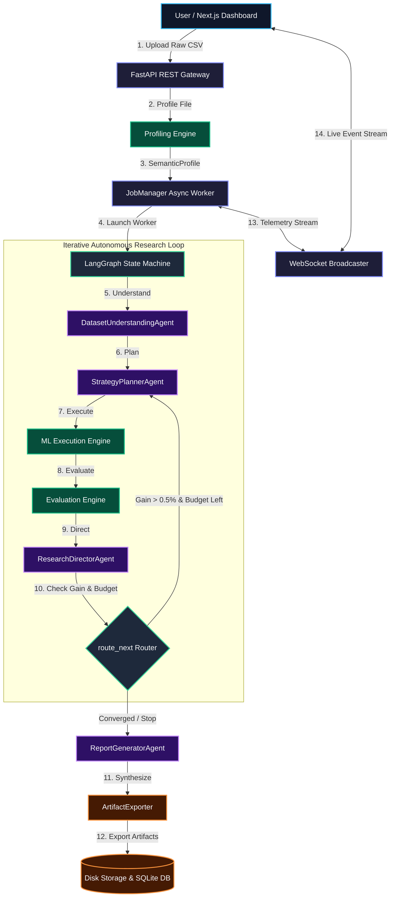
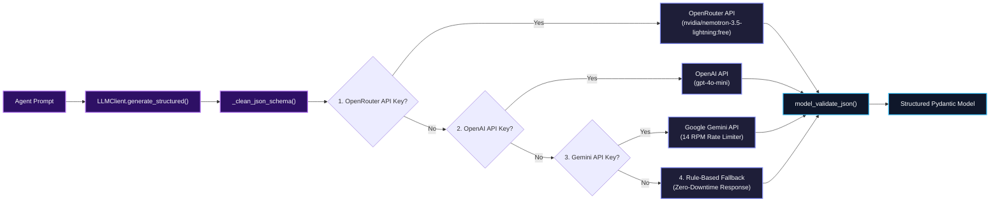

# DataPilot-AI 🚀
### Autonomous AI Data Science & Machine Learning Research Engine


-success.svg)

**DataPilot-AI** is an production-grade, autonomous AI research copilot that transforms raw tabular datasets into optimized, production-ready machine learning pipelines and actionable scientific reports. 

By unifying **LLM multi-agent reasoning**, **LangGraph state machine orchestration**, **statistical data profiling**, and **scikit-learn deterministic execution**, DataPilot-AI explores model architectures, prevents target memorization / data leakage, evaluates pipeline stability, and exports cleaned preprocessed CSV datasets in seconds.

---

## 🌟 Key Features

- 🧠 **Autonomous Agentic Consensus**: 5 LLM-driven agents (`DatasetUnderstanding`, `ConstraintGoal`, `StrategyPlanner`, `ResearchDirector`, `ReportGenerator`) leveraging OpenRouter (`nvidia/nemotron-3.5-lightning:free`) with zero-downtime rule fallbacks.
- 🎼 **LangGraph State Graph Topology**: Cyclic DAG orchestration enforcing max-iteration budget control and $0.5\%$ convergence detection.
- 🔬 **Deterministic ML Pipelines**: Auto-imputation, categorical encoding, feature scaling, and adaptive `StratifiedKFold` / `KFold` cross-validation.
- 🛡️ **Meta-Column Isolation**: Programmatically isolates non-predictive entity identifiers (`id`, `name`, `uuid`) to prevent target memorization while preserving them in exported datasets.
- 🏆 **5D Multi-Objective Composite Scoring**: Evaluates models via weighted scalarization ($35\%$ metric, $25\%$ generalization gap, $20\%$ variance, $10\%$ runtime cost, constraint screening).
- 📡 **Asynchronous Telemetry Streaming**: Event-driven WebSockets broadcast channel (`/ws/jobs/{job_id}`) serving live execution telemetry and log streams.
- 📦 **Polyglot Artifact Export Engine**: 1-click serialization of cleaned CSVs, pickled scikit-learn pipelines (`.pkl`), GitHub Markdown (`.md`), and glassmorphism HTML reports (`.html`).

---

## 🌊 High-Level Architecture & Real Flow Diagrams

### 1. End-to-End System Data Flow



---

### 2. LangGraph State Machine Topology

```mermaid
stateDiagram-v2
    [*] --> Profiling : Job Dispatched
    
    state Profiling {
        [*] --> DelimiterSniffer
        DelimiterSniffer --> SchemaAnalyzer
        SchemaAnalyzer --> QualityAnalyzer
    }

    Profiling --> Understanding : SemanticProfile Created

    state Understanding {
        [*] --> DatasetUnderstandingAgent
        DatasetUnderstandingAgent --> MissionBrief
    }

    Understanding --> Planning : MissionBrief Created

    state Planning {
        [*] --> StrategyPlannerAgent
        StrategyPlannerAgent --> ExperimentPlan
    }

    Planning --> Execution : ExperimentPlan Dispatched

    state Execution {
        [*] --> SeparateMetaCols
        SeparateMetaCols --> FitPipeline
        FitPipeline --> AdaptiveCV
    }

    Execution --> Evaluation : Batch Results Collected

    state Evaluation {
        [*] --> ScreenConstraints
        ScreenConstraints --> Composite5DRanking
        Composite5DRanking --> MineKnowledgeFindings
    }

    Evaluation --> Directing : EvaluationReport Created

    state Directing {
        [*] --> ResearchDirectorAgent
    }

    Directing --> RouterChoice : Evaluate route_next()

    state RouterChoice <<choice>>
    RouterChoice --> Planning : Continue / Refine (Budget Left)
    RouterChoice --> Reporting : Stop / Converged
    RouterChoice --> Failed : Execution Error

    state Reporting {
        [*] --> ReportGeneratorAgent
        ReportGeneratorAgent --> MarkdownGen
        MarkdownGen --> HTMLGen
    }

    Reporting --> Completed : Persist DB & Export Files
    Failed --> [*]
    Completed --> [*]
```



---

### 3. OpenRouter LLM Provider & Fallback Engine



---

## 📚 10-Phase Documentation Directory Index

Comprehensive, story-driven teacher documentation for every phase is available in the [`docs/`](file:///Users/akshitajariwala/Desktop/Akshita's%20Project/DataPilot-AI/docs) folder:

| Phase | Title | Documentation Link |
| :--- | :--- | :--- |
| **Overview** | **Master System Architecture Overview** | [`docs/00-master-system-architecture.md`](file:///Users/akshitajariwala/Desktop/Akshita's%20Project/DataPilot-AI/docs/00-master-system-architecture.md) |
| **Diagrams** | **High-Level Visual Architecture Diagrams** | [`docs/system-architecture-diagrams.md`](file:///Users/akshitajariwala/Desktop/Akshita's%20Project/DataPilot-AI/docs/system-architecture-diagrams.md) |
| **Phase 01** | Contracts & Pydantic Schemas | [`docs/phase-01-contracts-schemas.md`](file:///Users/akshitajariwala/Desktop/Akshita's%20Project/DataPilot-AI/docs/phase-01-contracts-schemas.md) |
| **Phase 02** | Database Layer & ORM Repositories | [`docs/phase-02-database-layer.md`](file:///Users/akshitajariwala/Desktop/Akshita's%20Project/DataPilot-AI/docs/phase-02-database-layer.md) |
| **Phase 03** | Core Config, Middleware & Exceptions | [`docs/phase-03-core-config-middleware.md`](file:///Users/akshitajariwala/Desktop/Akshita's%20Project/DataPilot-AI/docs/phase-03-core-config-middleware.md) |
| **Phase 04** | ML Execution Engine & Scikit-Learn Pipelines | [`docs/phase-04-api-services-websockets.md`](file:///Users/akshitajariwala/Desktop/Akshita's%20Project/DataPilot-AI/docs/phase-04-api-services-websockets.md) |
| **Phase 05** | AI Multi-Agent System & OpenRouter LLMs | [`docs/phase-05-ai-agents-llm-system.md`](file:///Users/akshitajariwala/Desktop/Akshita's%20Project/DataPilot-AI/docs/phase-05-ai-agents-llm-system.md) |
| **Phase 06** | Profiling Engine & Data Diagnostics | [`docs/phase-06-profiling-engine.md`](file:///Users/akshitajariwala/Desktop/Akshita's%20Project/DataPilot-AI/docs/phase-06-profiling-engine.md) |
| **Phase 07** | LangGraph State Machine Graph Engine | [`docs/phase-07-langgraph-orchestration.md`](file:///Users/akshitajariwala/Desktop/Akshita's%20Project/DataPilot-AI/docs/phase-07-langgraph-orchestration.md) |
| **Phase 08** | Evaluation Engine & Composite Model Ranking | [`docs/phase-08-evaluation.md`](file:///Users/akshitajariwala/Desktop/Akshita's%20Project/DataPilot-AI/docs/phase-08-evaluation.md) |
| **Phase 09** | Application Services, API Gateway & WebSockets | [`docs/phase-09-services-api.md`](file:///Users/akshitajariwala/Desktop/Akshita's%20Project/DataPilot-AI/docs/phase-09-services-api.md) |
| **Phase 10** | Final Research Reports & Artifact Exporters | [`docs/phase-10-reports.md`](file:///Users/akshitajariwala/Desktop/Akshita's%20Project/DataPilot-AI/docs/phase-10-reports.md) |

---

## ⚡ Quickstart Guide

### 1. Environment Setup
Create a `.env` file in the root directory:
```env
BACKEND_URL=http://localhost:8000
FRONTEND_URL=http://localhost:3000
DATABASE_URL=sqlite:///./datapilot.db
STORAGE_DIR=storage

# OpenRouter LLM Configuration
OPEN_ROUTER=your_openrouter_api_key_here
MODEL_NAME=nvidia/nemotron-3.5-lightning:free
```

### 2. Start the Backend API Server
```bash
# Install Python dependencies
pip install -r requirements.txt

# Launch FastAPI application on http://localhost:8000
uvicorn backend.main:app --reload --port 8000
```

### 3. Start the Next.js Frontend Dashboard
```bash
cd frontend

# Install Node dependencies
npm install

# Launch Next.js dev server on http://localhost:3000
npm run dev
```

### 4. Run the Full Test Suite
```bash
# Run all 69 unit & integration tests
pytest
```

---

## 🔌 API Reference Overview

| Endpoint Path | Method | Description |
| :--- | :--- | :--- |
| `POST /api/v1/upload` | `POST` | Upload raw CSV/Parquet file & return semantic profile |
| `POST /api/v1/jobs/start` | `POST` | Start autonomous AI research job in background |
| `GET /api/v1/jobs/{job_id}` | `GET` | Retrieve live job status, stage, and progress % |
| `GET /api/v1/experiments/{job_id}` | `GET` | Retrieve experiment leaderboard rankings & metrics |
| `GET /api/v1/reports/{job_id}` | `GET` | Retrieve final recommendation report |
| `GET /api/v1/reports/{job_id}/download-dataset` | `GET` | **Export preprocessed cleaned CSV dataset artifact** |
| `WS /ws/jobs/{job_id}` | `WS` | Real-time WebSocket event subscription channel |

---

## 📄 License
Distributed under the MIT License. See `LICENSE` for more information.
