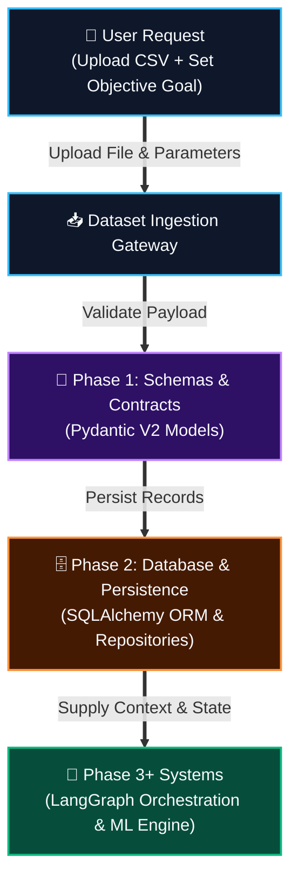
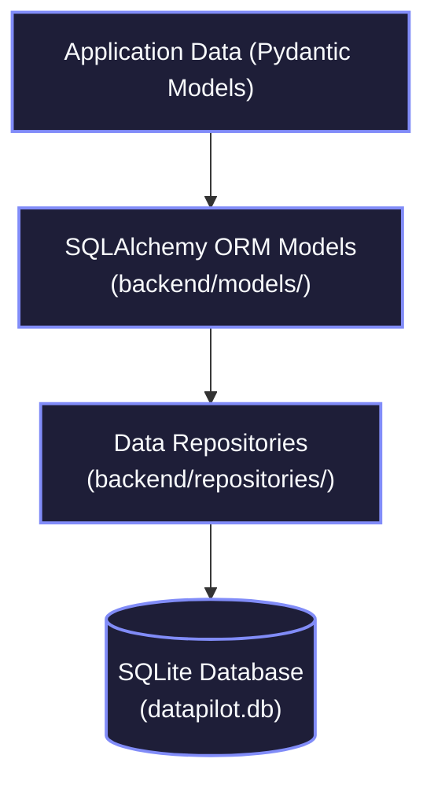
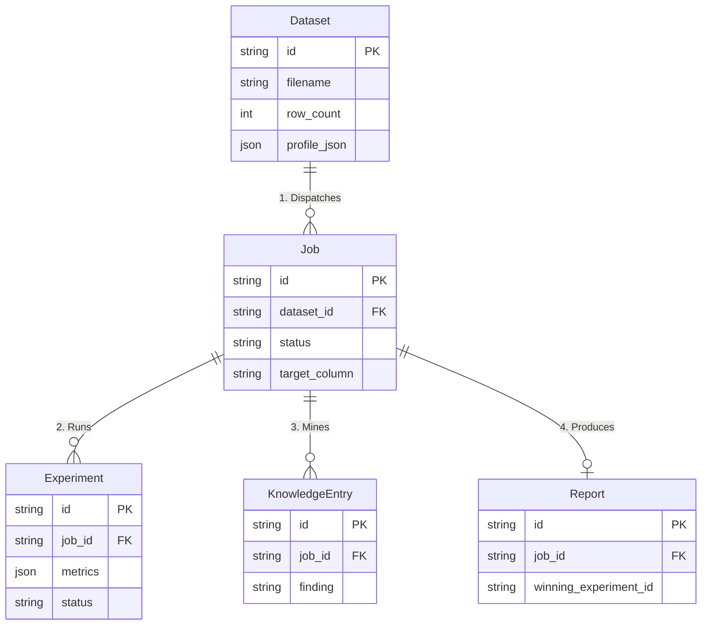
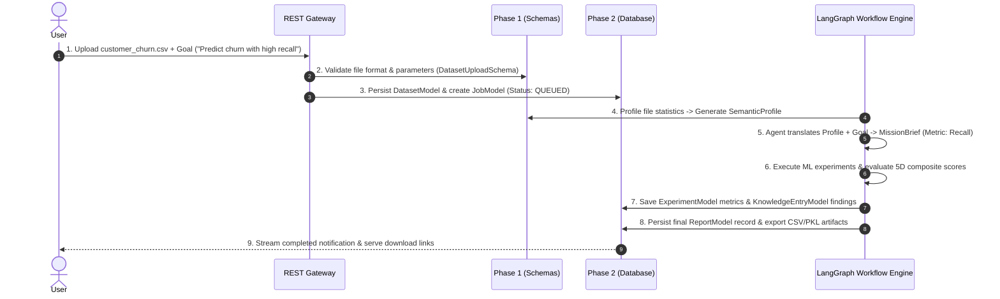
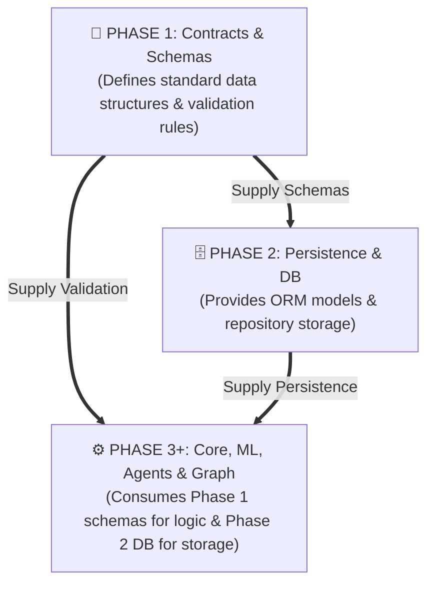

<div align="center">

# 🚀 DataPilot-AI
### Autonomous AI Data Science & Machine Learning Research Engine

[](https://python.org)
[](https://fastapi.tiangolo.com)
[](https://langchain.com)
[](https://nextjs.org)
[](https://openrouter.ai)
[-2EA44F?style=for-the-badge&logo=pytest&logoColor=white)](https://pytest.org)

</div>

---

## 📌 1. The Big Picture System Architecture



---

## 📑 2. Phase 1 — Contracts & Schemas

> **Phase 1 defines the common structure and universal vocabulary used across all of DataPilot-AI.**

### Information Flow Through Contracts


| Contract Schema File | Primary Role | Output Contract |
| :--- | :--- | :--- |
| [`backend/schemas/semantic_profile.py`](file:///Users/akshitajariwala/Desktop/Akshita's%20Project/DataPilot-AI/backend/schemas/semantic_profile.py) | Captures column types, stats, missing values & data quality risks | `SemanticProfile` |
| [`backend/schemas/mission_brief.py`](file:///Users/akshitajariwala/Desktop/Akshita's%20Project/DataPilot-AI/backend/schemas/mission_brief.py) | Translates raw goal into target metric, risk level & constraints | `MissionBrief` |
| [`backend/schemas/experiment.py`](file:///Users/akshitajariwala/Desktop/Akshita's%20Project/DataPilot-AI/backend/schemas/experiment.py) | Defines preprocessing operations, model family & CV execution results | `ExperimentConfig` / `ExperimentResult` |
| [`backend/schemas/evaluation.py`](file:///Users/akshitajariwala/Desktop/Akshita's%20Project/DataPilot-AI/backend/schemas/evaluation.py) | Scores model rankings across 5 composite dimensions & mines findings | `EvaluationReport` |
| [`backend/schemas/report.py`](file:///Users/akshitajariwala/Desktop/Akshita's%20Project/DataPilot-AI/backend/schemas/report.py) | Synthesizes executive summary, top pipeline & business guidance | `FinalRecommendation` |

---

## 🗄️ 3. Phase 2 — Database & Persistence

> **Phase 2 provides persistent storage for all research artifacts created during execution.**

### Persistence Architecture Stack



### Entity Relationship Model



---

## 🎬 4. Animated End-to-End System Walkthrough

**Scenario**: User uploads `customer_churn.csv` and sets objective: *"Predict customer churn with high recall."*



### Step-by-Step Execution Sequence

| Step | What Happens | Why It Happens | Where It Goes Next |
| :---: | :--- | :--- | :--- |
| **1** | User uploads `customer_churn.csv` | File ingestion & initial research setup | REST Gateway (`upload.py`) |
| **2** | System calculates SHA256 & validates payload | Guarantees schema integrity via `backend/schemas/dataset.py` | Storage & Database Layer |
| **3** | `DatasetModel` & `JobModel` saved to DB | Ensures job state survives server restarts | `DatasetRepository` & `JobRepository` |
| **4** | Dataset profiling runs | Calculates missing values, data types & quality risks | `ProfilingEngine` |
| **5** | Profiling output compiled into `SemanticProfile` | Provides structured input for AI Agents | `DatasetUnderstandingAgent` |
| **6** | LangGraph state machine iterates research loops | Trains candidate ML models & evaluates performance | `MLExecutionEngine` |
| **7** | `ExperimentModel` & `KnowledgeEntryModel` saved | Stores cross-validation scores & strategy insights | `ExperimentRepository` |
| **8** | Final recommendation report rendered | Packages Markdown/HTML & pickled models | `ReportService` & `ArtifactExporter` |
| **9** | User receives discharge summary & download links | Completes autonomous research cycle | Frontend Web Dashboard |

---

## 💡 5. The Core Data Model Pipeline

Understanding how data representation evolves across system layers:

```text
1. Pydantic Schema       👉 "What structure must input/output data strictly follow?"
        ↓
2. LangGraph State       👉 "What active context is currently passing through the live workflow?"
        ↓
3. SQLAlchemy Model      👉 "How is this data structured for database persistence?"
        ↓
4. Repository            👉 "What methods do we use to query, insert, or update this data?"
        ↓
5. SQLite Database       👉 "Where is this data permanently saved on disk?"
```

---

## 💾 6. In-Memory vs. Persistent Data

```text
IN-MEMORY (Transient State)
┌─────────────────────────────────────────────────────────┐
│ • LangGraph State Channel (WorkflowStateDict)           │
│ • Ephemeral Pydantic Objects (SemanticProfile, Brief)   │
│ • Intermediate Model Pipeline Estimators & Arrays       │
└─────────────────────────────────────────────────────────┘
                            │
                            ▼  (Persisted via Repositories)
PERSISTED (Permanent Storage)
┌─────────────────────────────────────────────────────────┐
│ • Dataset Records (storage/datasets/ + DatasetModel)    │
│ • Research Job Metadata (JobModel)                      │
│ • Experiment Leaderboard & Metrics (ExperimentModel)    │
│ • Scientific Knowledge Base (KnowledgeEntryModel)      │
│ • Markdown, HTML & PKL Model Artifacts (ReportModel)    │
└─────────────────────────────────────────────────────────┘
```

- **In-Memory Data**: Exists only while a research node is actively executing.
- **Persisted Data**: Written to `datapilot.db` and disk storage so research history, leaderboard scores, and reports remain accessible indefinitely.

---

## 🔗 7. Phase Dependency Topology



---

## 📚 8. 10-Phase Documentation Index

| Phase | Module Title | Document Reference | Primary Focus |
| :---: | :--- | :--- | :--- |
| **Index** | **Master System Architecture** | [`docs/00-master-system-architecture.md`](file:///Users/akshitajariwala/Desktop/Akshita's%20Project/DataPilot-AI/docs/00-master-system-architecture.md) | Full 10-Phase Executive System Index & Map |
| **Phase 01** | Contracts & Schemas | [`docs/phase-01-contracts-schemas.md`](file:///Users/akshitajariwala/Desktop/Akshita's%20Project/DataPilot-AI/docs/phase-01-contracts-schemas.md) | Pydantic V2 Models, Enums & State Contracts |
| **Phase 02** | Database Layer & ORM | [`docs/phase-02-database-layer.md`](file:///Users/akshitajariwala/Desktop/Akshita's%20Project/DataPilot-AI/docs/phase-02-database-layer.md) | SQLAlchemy 2.0 Repositories & SQLite Schemas |
| **Phase 03** | Core Config & Middleware | [`docs/phase-03-core-config-middleware.md`](file:///Users/akshitajariwala/Desktop/Akshita's%20Project/DataPilot-AI/docs/phase-03-core-config-middleware.md) | Environment Config, Correlation ID & CORS |
| **Phase 04** | ML Execution Engine | [`docs/phase-04-api-services-websockets.md`](file:///Users/akshitajariwala/Desktop/Akshita's%20Project/DataPilot-AI/docs/phase-04-api-services-websockets.md) | Scikit-Learn Pipelines & Adaptive CV Execution |
| **Phase 05** | AI Multi-Agent System | [`docs/phase-05-ai-agents-llm-system.md`](file:///Users/akshitajariwala/Desktop/Akshita's%20Project/DataPilot-AI/docs/phase-05-ai-agents-llm-system.md) | 5 OpenRouter AI Agents & Fallback Logic |
| **Phase 06** | Profiling Engine | [`docs/phase-06-profiling-engine.md`](file:///Users/akshitajariwala/Desktop/Akshita's%20Project/DataPilot-AI/docs/phase-06-profiling-engine.md) | Automated Data Diagnostics & Quality Checks |
| **Phase 07** | LangGraph Orchestration | [`docs/phase-07-langgraph-orchestration.md`](file:///Users/akshitajariwala/Desktop/Akshita's%20Project/DataPilot-AI/docs/phase-07-langgraph-orchestration.md) | Stateful Graph State Machine & Router Rules |
| **Phase 08** | Evaluation Engine | [`docs/phase-08-evaluation.md`](file:///Users/akshitajariwala/Desktop/Akshita's%20Project/DataPilot-AI/docs/phase-08-evaluation.md) | 5D Composite Scoring & Knowledge Mining |
| **Phase 09** | Services & API Gateway | [`docs/phase-09-services-api.md`](file:///Users/akshitajariwala/Desktop/Akshita's%20Project/DataPilot-AI/docs/phase-09-services-api.md) | Async Workers, REST Endpoints & WebSockets |
| **Phase 10** | Final Reports & Exporters | [`docs/phase-10-reports.md`](file:///Users/akshitajariwala/Desktop/Akshita's%20Project/DataPilot-AI/docs/phase-10-reports.md) | Markdown/HTML Synthesizer & Artifact Export |

---

## ⚡ Quickstart Guide

### 1. Environment Setup
Configure your environment variables in `.env`:
```env
BACKEND_URL=http://localhost:8000
FRONTEND_URL=http://localhost:3000
DATABASE_URL=sqlite:///./datapilot.db
STORAGE_DIR=storage

# OpenRouter LLM Settings
OPEN_ROUTER=sk-or-v1-your-key-here
MODEL_NAME=nvidia/nemotron-3.5-lightning:free
```

### 2. Launch Backend Gateway & Frontend Dashboard
```bash
# Terminal 1: Launch Backend API Server
uvicorn backend.main:app --reload --port 8000

# Terminal 2: Launch Next.js Dashboard
cd frontend && npm run dev
```

### 3. Run Automated Verification Suite
```bash
# Execute unit and integration tests (69 passed)
pytest
```

---

## 🧠 Final Mental Model & Takeaways

1. **Phase 1 is the Universal Language**: Pydantic schemas enforce type safety across agents, ML execution, and API routes.
2. **Phase 2 is the Memory Vault**: SQLAlchemy ORM models and repositories make research progress permanent.
3. **Separation of Concerns**: Contracts validate, LangGraph routes, Repositories persist, and ML Engine executes.
4. **Data Leakage Safeguard**: Metadata columns (`id`, `name`) are isolated during ML training but preserved in Phase 2 exported datasets.
5. **Decoupled Architecture**: Services interact with the database exclusively through repositories (`DatasetRepository`, `JobRepository`).
